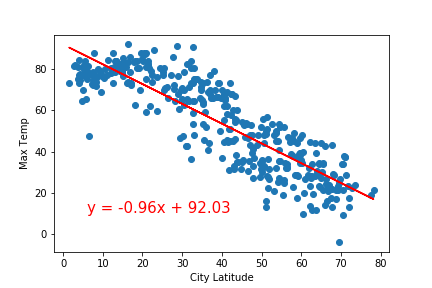
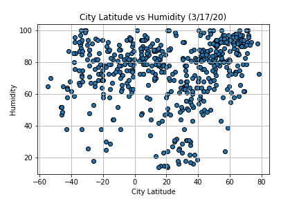

<!--
*** Thanks for checking out this README Template. If you have a suggestion that would
*** make this better, please fork the repo and create a pull request or simply open
*** an issue with the tag "enhancement".
*** Thanks again! Now go create something AMAZING! :D
***
***
***
*** To avoid retyping too much info. Do a search and replace for the following:
*** github_username, repo_name, twitter_handle, email
-->


<!-- PROJECT SHIELDS -->
<!--
*** I'm using markdown "reference style" links for readability.
*** Reference links are enclosed in brackets [ ] instead of parentheses ( ).
*** See the bottom of this document for the declaration of the reference variables
*** for contributors-url, forks-url, etc. This is an optional, concise syntax you may use.
*** https://www.markdownguide.org/basic-syntax/#reference-style-links
-->


<!-- PROJECT LOGO -->
<br />
<p align="center">
  <a href="https://github.com/lsebahar/Vacation-Weather-Report-Generator">
    
  </a>

  <h3 align="center">Vacation Weather Analyzer</h3>

  <p align="center">
    Leveraging API's to help you pick your vacation!
    <br />
    <a href="https://github.com/lsebahar/Vacation-Weather-Report-Generator"><strong>Explore the docs »</strong></a>
    <br />
    <br />
    <a href="https://github.com/lsebahar/Vacation-Weather-Report-Generator">View Demo</a>
    ·
    <a href="https://github.com/lsebahar/Vacation-Weather-Report-Generator/issues">Report Bug</a>
    ·
    <a href="https://github.com/lsebahar/Vacation-Weather-Report-Generator/issues">Request Feature</a>
  </p>
</p>


<!-- TABLE OF CONTENTS -->
## Table of Contents

* [About the Project](#about-the-project)
  * [Built With](#built-with)
* [Getting Started](#getting-started)
  * [Prerequisites](#prerequisites)
  * [Installation](#installation)
* [Usage](#usage)
* [Roadmap](#roadmap)
* [Contributing](#contributing)
* [Contact](#contact)
* [Acknowledgements](#acknowledgements)


<!-- ABOUT THE PROJECT -->
## About The Project


Did you know that toilets flush in the opposite direction south of the Equator? Well, it kinda depends on the design of the toilet, but it is undeniably true that the seasons are flipped Down Under, and there is data to prove it!    

This project sets out to analyze & visualize weather patterns in cities across the world, to help you find the best vacation spots. Here's how it works:

1) Use numpy to generate random pairings of latitudes & longitudes

2) Use citipy to find the nearest city to all those pairings of coordinates

3) Perform calls to openweathermap API to get weather data on those cities

4) Store results in a dataframe

5) Plot the data using matplotlib's pyplot


### Built With

* Jupyter Notebook
* Python
* Pandas
* matplotlib
* Scipy


<!-- GETTING STARTED -->
## Getting Started

To get a local copy up and running follow these simple steps.

### Prerequisites

1) Install gmaps and obtain an API key

2) Make an account to obtain an API key from openweathermap.org

3) Install citipy

4) Install Pandas, numpy, matplotlib, scipy

5) Install Jupyter Notebook


### Installation

1) Clone the repo
```sh
git clone https://github.com/lsebahar/Vacation-Weather-Report-Generator.git
```


2) Add a config.py file which contains the variables g_key and weather_api_key to the "VacationPy" & "WeatherPy" folders


3) Run the WeatherPy Jupyter Notebook file (all of the cells)


4) Then, run the VacationPy file (also all of the cells)


5) These should generate various charts which will help you understand where the weather is good and when!


<!-- USAGE EXAMPLES -->
## Usage

Check out the the relationship between latitude and temperature in the Northern Hemisphere: 



Or how Humidity correlates with Latitude:



**Depending on the activities you like, weather might not make a big difference for you on vacation. For everyone else, I hope this helps!**

<!-- ROADMAP -->
## Roadmap

See the [open issues](https://github.com/lsebahar/Vacation-Weather-Report-Generator/issues) for a list of proposed features (and known issues).


<!-- CONTRIBUTING -->
## Contributing

Contributions are what make the open source community such an amazing place to be learn, inspire, and create. Any contributions you make are **greatly appreciated**.

1. Fork the Project
2. Create your Feature Branch (`git checkout -b feature/AmazingFeature`)
3. Commit your Changes (`git commit -m 'Add some AmazingFeature'`)
4. Push to the Branch (`git push origin feature/AmazingFeature`)
5. Open a Pull Request


<!-- CONTACT -->
## Contact

Levi Sebahar - leviseb@gmail.com

Project Link: [https://github.com/lsebahar/Vacation-Weather-Report-Generator](https://github.com/lsebahar/Vacation-Weather-Report-Generator)


<!-- ACKNOWLEDGEMENTS -->
## Acknowledgements

* The Data Science & Visualization Bootcamp
* UCSD Extension
* Github user othneildrew (readme template)


<!-- MARKDOWN LINKS & IMAGES -->
<!-- https://www.markdownguide.org/basic-syntax/#reference-style-links -->
[contributors-shield]: https://img.shields.io/github/contributors/github_username/repo.svg?style=flat-square
[contributors-url]: https://github.com/github_username/repo/graphs/contributors
[forks-shield]: https://img.shields.io/github/forks/github_username/repo.svg?style=flat-square
[forks-url]: https://github.com/github_username/repo/network/members
[stars-shield]: https://img.shields.io/github/stars/github_username/repo.svg?style=flat-square
[stars-url]: https://github.com/github_username/repo/stargazers
[issues-shield]: https://img.shields.io/github/issues/github_username/repo.svg?style=flat-square
[issues-url]: https://github.com/github_username/repo/issues
[license-shield]: https://img.shields.io/github/license/github_username/repo.svg?style=flat-square
[license-url]: https://github.com/github_username/repo/blob/master/LICENSE.txt
[linkedin-shield]: https://img.shields.io/badge/-LinkedIn-black.svg?style=flat-square&logo=linkedin&colorB=555
[linkedin-url]: https://linkedin.com/in/github_username
[product-screenshot]: images/screenshot.png
